## 说明
- 模拟器工程在XTerminal\2.Software\XTerminal-ESP32-simulator
- 模拟器工程使用Visual Studio 2019
- 代码工程在XTerminal\2.Software\XTerminal-ESP32-simulator
- 代码工程基于Platformio

 
#
PCB在项目工程的1.Hardware中，使用Kicad绘制。分为主控板和音频板，两者的硬件连接没有设计好，实际焊接为了便于组装就用了粗一点的飞线把主控板和音频板上的sd卡引脚和音频信号引脚连了起来，我只做了临时的用于验证的一个版本，后面没有心情完善了，只能说这只用于抛砖引玉。
#

#### 主控板焊接
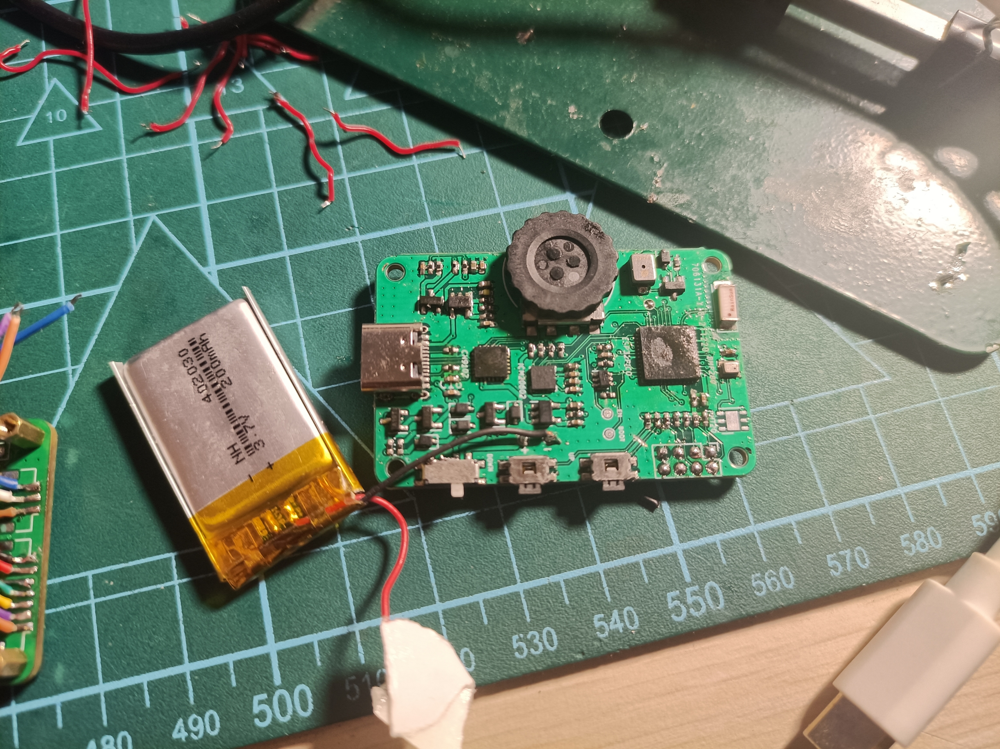
#### 音频板焊接
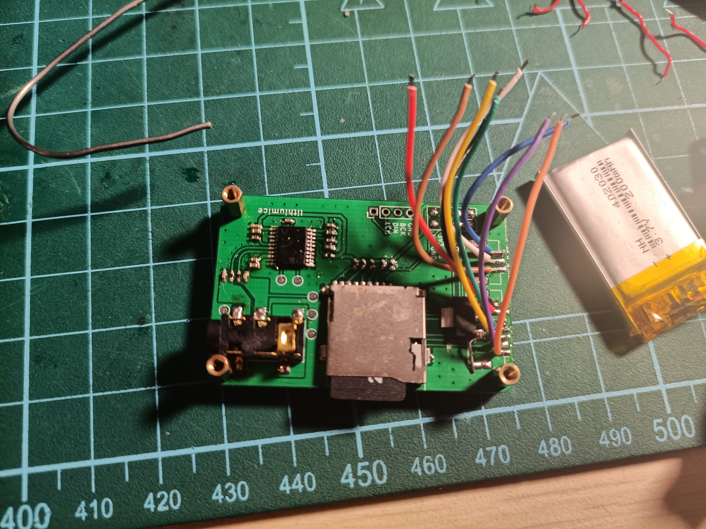
#### 焊接和组装完成的成品效果：
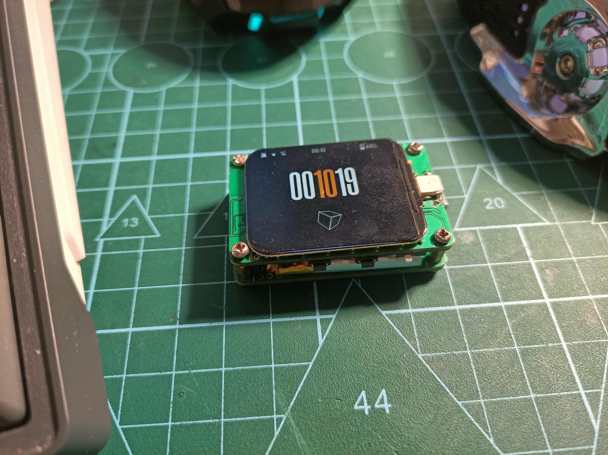
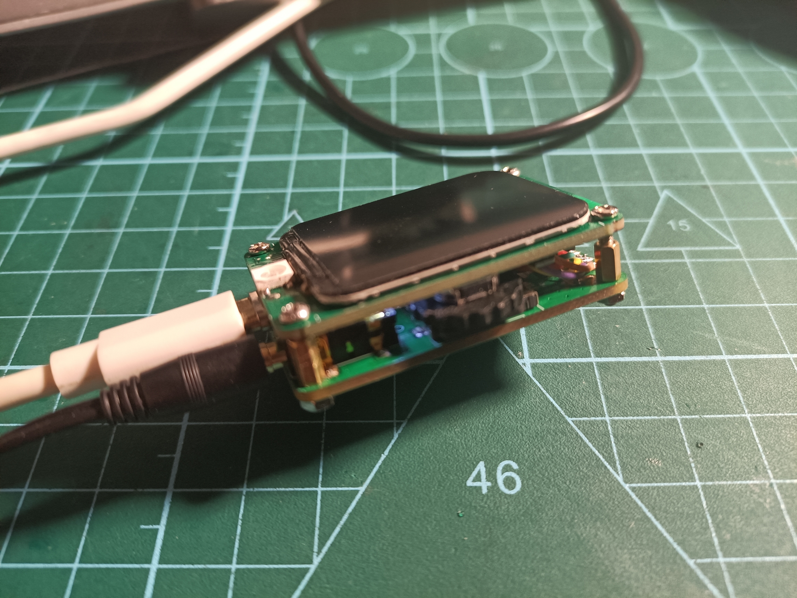
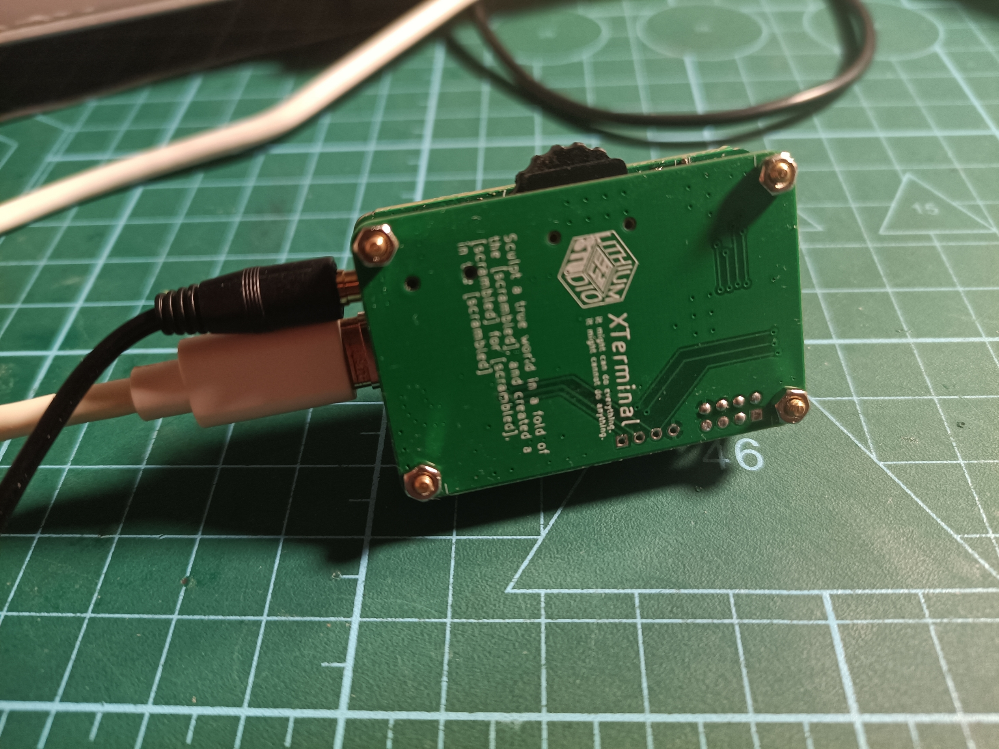

#### 主界面：（没拍实物图，就只好放模拟器的截图了）
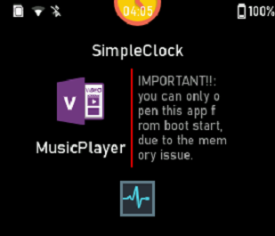
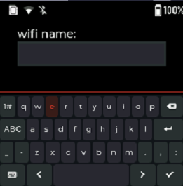
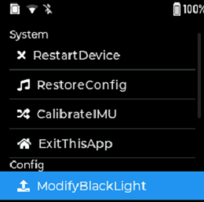
#### 天气显示：
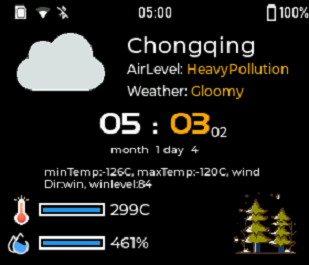
#### 几个Arduboy小游戏
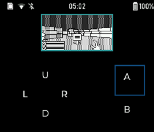
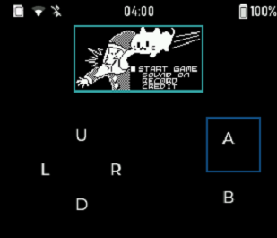
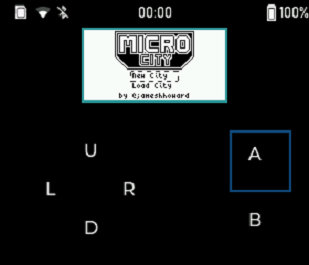

#### PCB示例
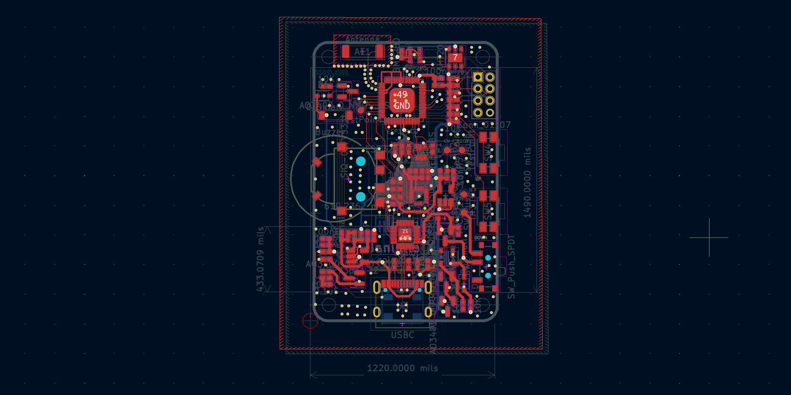

#### 原理图示例
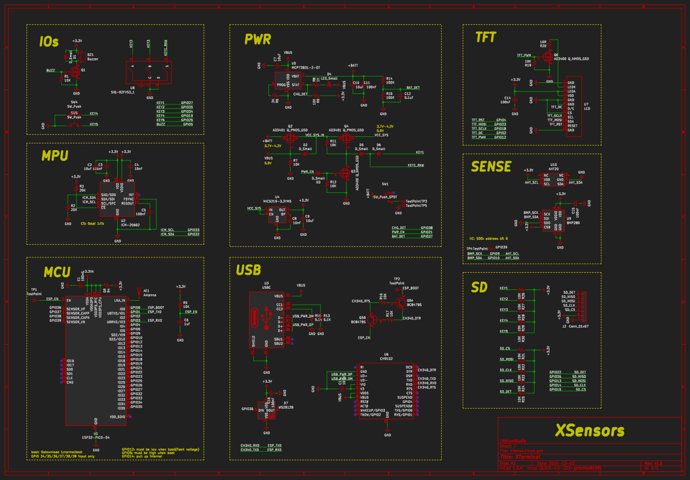
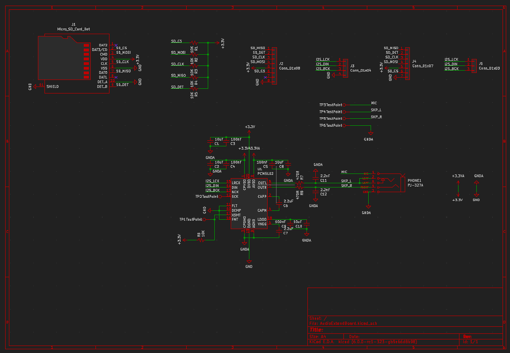